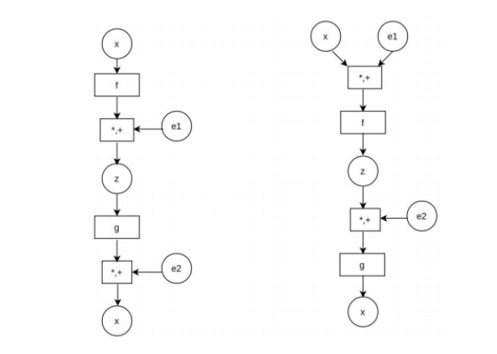
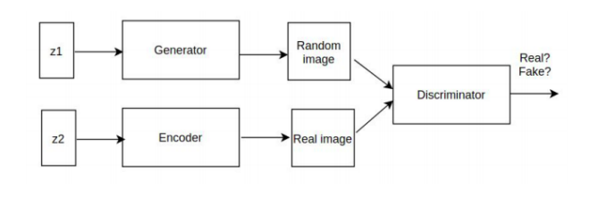
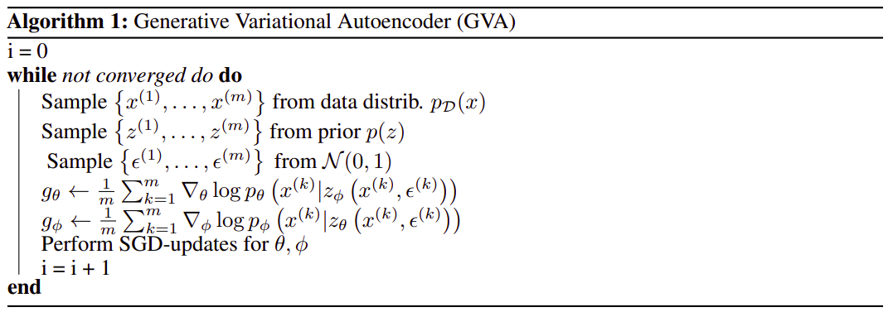
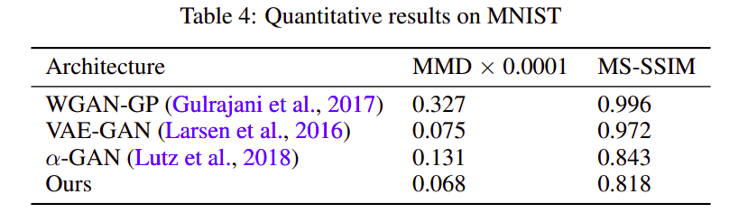
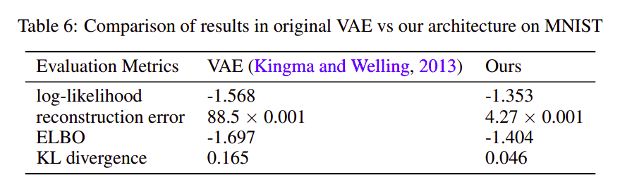
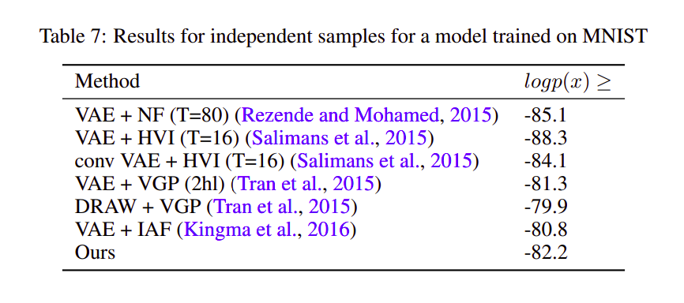
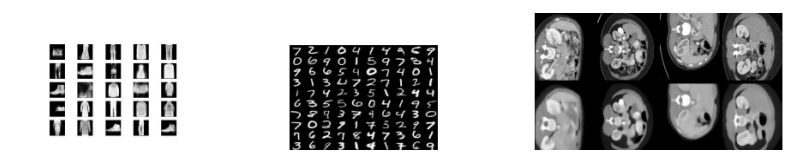
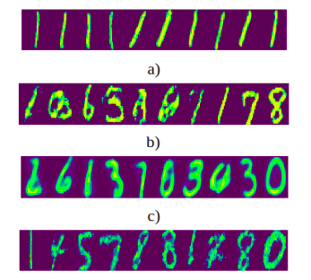

# Generate High Fidelity Images With Generative Variational Autoencoder
Code for the paper `Generate High Fidelity Images With Generative Variational Autoencoder`.

Link to [Paper](https://abhinavsagar.github.io/files/gvae.pdf).

Link to [Blog](https://towardsdatascience.com/generative-variational-autoencoder-for-high-resolution-image-synthesis-48dd98d4dcc2).


## Abstract

In this work, we address the problem of blurred images which are often generated
using Variational Autoencoders and the problem of mode collapse in Generative
Adversarial Networks using a single model architecture. We use the encoder of
VAE as it is while replacing the decoder with a discriminator. The encoder is fed
data from a normal distribution while the generator is fed that from a gaussian
distribution. The combination from both is then fed to a discriminator which tells
whether the generated images are correct or not. We evaluate our network on 3
different datasets: MNIST, fashion MNIST and TCIA Pancreas CT dataset. On
training the model for 300 iterations, it was able to generate much sharper images
as compared to those of VAEs. This work is potentially very exciting as we are
able to combine the advantages of generative models and inference models in a
bayesian manner.

## Data

The dataset can be downloaded from [here](https://www.cancerimagingarchive.net/).

## Network Architecture

### Standard VAE vs our Model



### Our network architecture



## Algorithm



## Usage

`pip install tensorflow-gpu numpy scipy matplotlib tqdm`

`python tools/download_mnist.py`

`python gvae/main/train.py`

`python gvae/main/test.py`

## Experiments







## Results

### Generated images a) MNIST b) Fashion MNIST c) TCIA Pancreas CT



### Generated MNIST images a) GAN b) WGAN c) VAE d) GVAE



## Citing

If you find this code useful in your research, please consider citing the paper:

```
@article{sagargenerate,
  title={Generate High Fidelity Images With Generative Variational Autoencoder},
  author={Sagar, Abhinav}
}
```

## License

```
MIT License

Copyright (c) 2020 Abhinav Sagar

Permission is hereby granted, free of charge, to any person obtaining a copy
of this software and associated documentation files (the "Software"), to deal
in the Software without restriction, including without limitation the rights
to use, copy, modify, merge, publish, distribute, sublicense, and/or sell
copies of the Software, and to permit persons to whom the Software is
furnished to do so, subject to the following conditions:

The above copyright notice and this permission notice shall be included in all
copies or substantial portions of the Software.

THE SOFTWARE IS PROVIDED "AS IS", WITHOUT WARRANTY OF ANY KIND, EXPRESS OR
IMPLIED, INCLUDING BUT NOT LIMITED TO THE WARRANTIES OF MERCHANTABILITY,
FITNESS FOR A PARTICULAR PURPOSE AND NONINFRINGEMENT. IN NO EVENT SHALL THE
AUTHORS OR COPYRIGHT HOLDERS BE LIABLE FOR ANY CLAIM, DAMAGES OR OTHER
LIABILITY, WHETHER IN AN ACTION OF CONTRACT, TORT OR OTHERWISE, ARISING FROM,
OUT OF OR IN CONNECTION WITH THE SOFTWARE OR THE USE OR OTHER DEALINGS IN THE
SOFTWARE.
```


